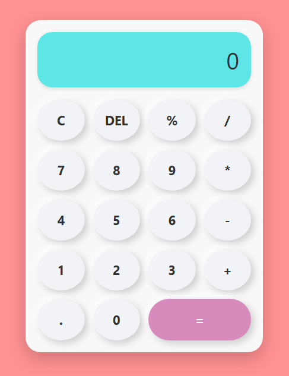
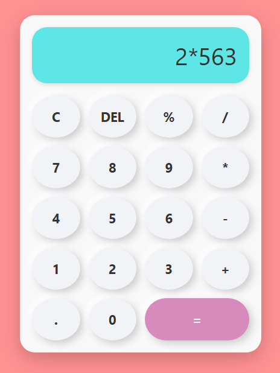
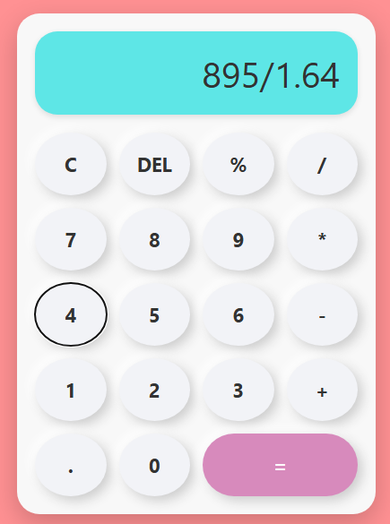

# Calculator App 

---

## 📋 Table of Contents
- 🏷️ [Introduction](#introduction)
- 💻 [Live Demo](#live-demo)
- 📷 [Screenshots](#screenshots)
- ✨ [Features](#features)
- 🗂️ [Project structure](#project-structure)
- ▶️ [Usage](#usage)
- ⚠️ [Notes](#notes)
- 🫱🏻‍🫲🏼 [Contributing](#contributing)
- 📜 [License](#license)
- 👨🏻‍💻 [Author](#author--acknowledgments--contact) / 🙏🏻 [Acknowledgments](#author--acknowledgments--contact) / 📩 [Contact](#author--acknowledgments--contact)
- 💰 [Support Me!](#if-you-want-to-support-me)

---

## Introduction
A fully functional calculator built using **HTML**, **CSS**, and **Vanilla JavaScript**, complete with keyboard support and button click sounds. Designed to be clean, responsive, and easy to use.
<!-- ## Badges -->

---

## Live Demo
- [⛓️‍💥 Demo](https://web-calculator-app-wheat.vercel.app/)

---

## Screenshots
<p align="center">
  
</p>

<br>

<p align="center">
  
  
</p>

---

## Features
- Basic arithmetic operations: `+`, `-`, `*`, `/`, `%`
- Responsive design with Neumorphism-inspired UI
- Keyboard input support (`0-9`, operators, `Enter`, `Backspace`, `C`)
- Sound effect on every keypress or button press
- Display handles `Error` gracefully

---

## Project Structure
- 📁 root
- ├── index.html # Main HTML layout
- ├── style.css # Styling and layout
- ├── script.js # Calculator logic and keyboard events
- ├── .gitignore # Git exclusions
- ├── LICENSE # MIT license
- └── README.md # Project documentation
<!-- ## Requirements -->
<!-- Installation -->

---

## Installation
1. Clone the repository:
```bash
git clone https://github.com/xAndreiix/Web_Calculator_App.git
cd calculator-app
```
2. Open index.html directly in your browser.
3. Click or use your keyboard to interact with the calculator.

---

## Usage
- Key	            |       Action
- 0–9	            |       Enter number
- + - * / %	      |       Operators
- Enter	         |       Calculate
- Backspace	      |       Delete last char
- C / c	         |       Clear display
<!-- ## Configuration -->
<!-- ## Runing tests -->
<!-- ## Deployment -->

---

## Notes
- eval() is used for simplicity. Avoid this in production-grade apps unless fully sanitized.
- Audio plays via the <audio> element. Can be customized in index.html.
<!-- ## Road Map -->
<!-- ## FAQ -->

---

## Contributing
Pull requests are welcome.
For major changes, please open an issue first to discuss what you’d like to change.
<!-- ## Changelog -->

---

## License
This project is licensed under the MIT License - see the [LICENSE](LICENSE)

---

## Author / Acknowledgments / Contact
**Author:** 
Andrei Iliescu

[](https://xandreiix.github.io/Andrei-Iliescu-Portfolio/)

**Acknowledgments:**  
- Inspired by @i.code4u tutorial on TikTok.

[](https://www.tiktok.com/@i.code4u/photo/7524973171972295958?is_from_webapp=1&sender_device=pc)
- All thanks to him for the tutorial!

**Contact:**  

[](https://linkedin.com/in/andrei-iliescu-aa7910214)<br>
[](mailto:andrey_iliescu@yahoo.com)<br>
[](mailto:andrei.iliescu13102000@gmail.com)

---

## If you want to support me
[](https://paypal.me/xAndreiix)<br>
[](https://revolut.me/xandreiix)
